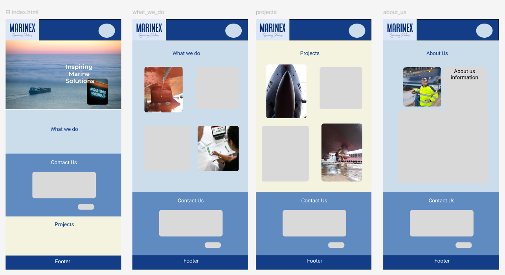
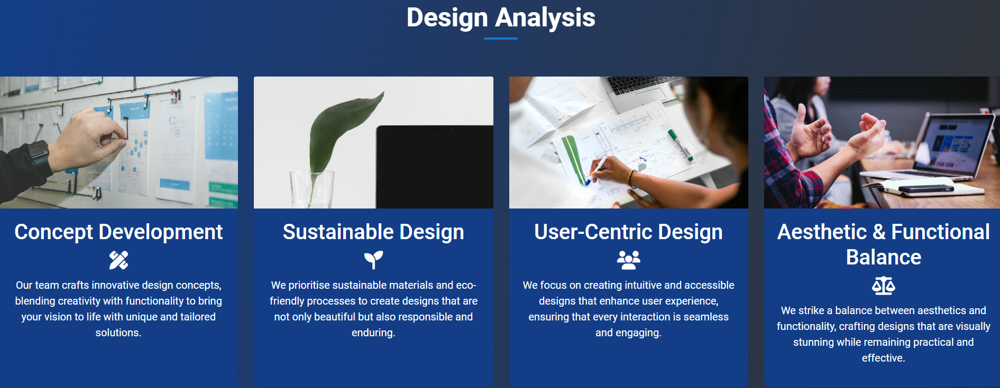
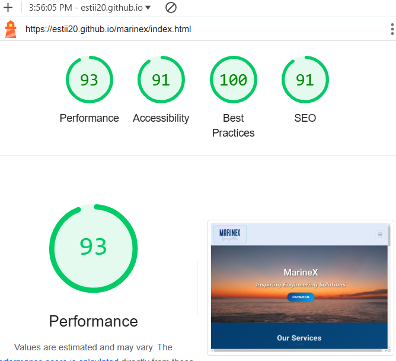
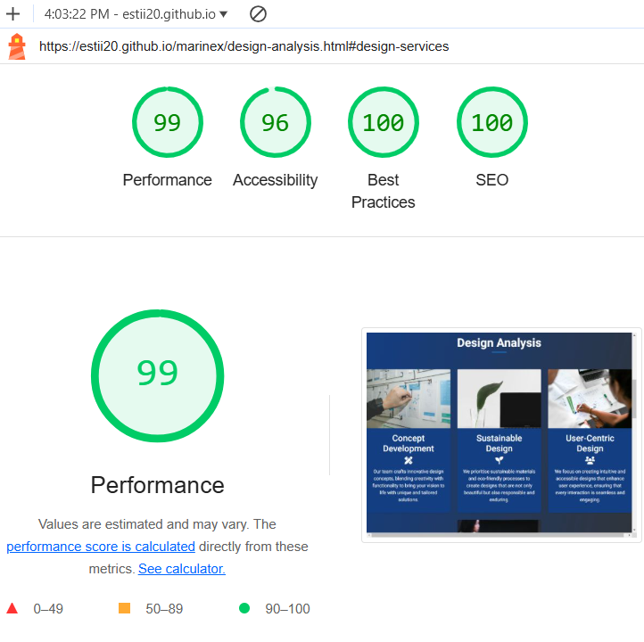
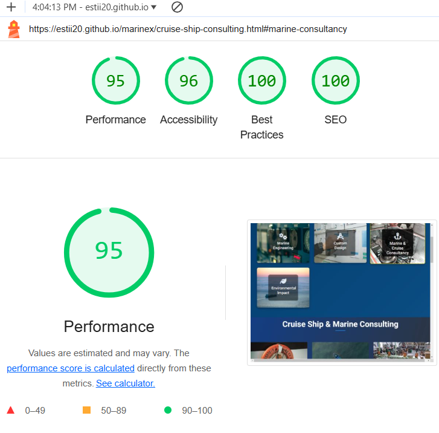
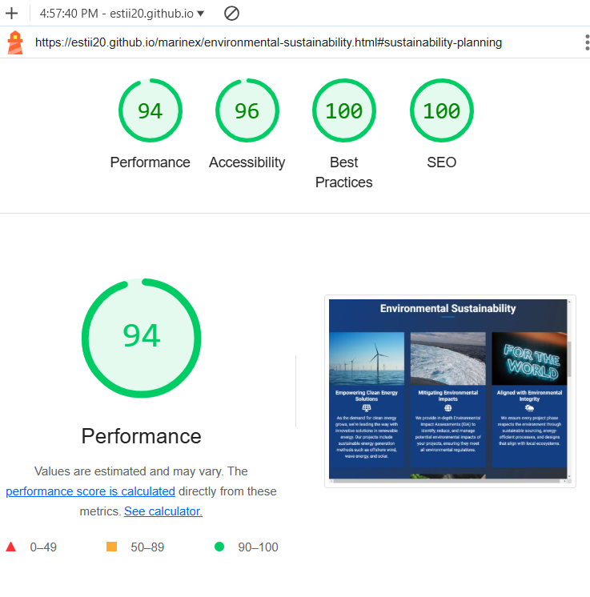

# Marinex

[Live Site](https://estii20.github.io/marinex/index.html)

An international Cruise Ship and Marine Engineering Consultant. Full project management throughout the world, involved in all aspects of the design, environmental solutions and newbuild/retrofit for cruise ship and marine projects.

[Website Mock-up](https://ui.dev/amiresponsive?url=https://estii20.github.io/marinex/index.html)

## Table of contents

- [UX Design](#ux-design)
- [User Stories](#user-stories)
- [Features](#features)
- [Future Features](#future-features)
- [Testing](#testing)
- [Languages Used](#languages-used)
- [Frameworks, Libraries and Programs Used](#frameworks-libraries-and-programs-used)
- [Technologies Used](#technologies-used)
- [Deployment and Publishing](#deployment-and-publishing)
- [Resources](#resources)
- [Credits](#credits)
- [Acknowledgements](#acknowledgements)

## UX Design

The design of this website was guided by key UX principles to ensure an optimal user experience across various devices and use cases. Below are the design criteria that informed the development process:

1. User-Centric Navigation
Goal: Simplify navigation to allow users to find information quickly and efficiently.
Implementation: A clearly defined services section with icons and labels to represent each offering.
Highlighted navigation circles indicating the current page for user orientation.
Intuitive linking between sections and pages (e.g., FAQ linked both to the homepage and directly to its section).

2. Responsiveness
Goal: Deliver a consistent experience across all screen sizes, from mobile to desktop.
Implementation:
Utilisation of a responsive grid system (Bootstrap) to ensure fluid layouts.
Flexibility in card designs and service sections to stack or align dynamically based on screen size.
Optimised images and content scaling to avoid distortion or clipping.
3. Visual Hierarchy
Goal: Use visual design elements to guide the user's attention to the most critical content.
Implementation:
Prominent headings and icons to identify key sections and services.
Consistent use of whitespace to separate elements for readability.
Hover effects on interactive elements like service cards and navigation links.
4. Accessibility
Goal: Make the website inclusive and usable for all individuals, including those with disabilities.
Implementation:
High-contrast color scheme for text readability.
Descriptive alt text for images to support screen readers.
Logical tab order and keyboard accessibility for interactive elements.
5. Aesthetics and Brand Consistency
Goal: Maintain a clean, modern design that reflects professionalism and aligns with the brand’s identity.
Implementation:
A consistent color palette and typography across all pages.
Use of relevant, high-quality images for each service or content section.
Subtle animations to enhance interactivity without overwhelming the user.
6. Performance Optimisation
Goal: Ensure the website loads quickly and operates smoothly to minimise user frustration.
Implementation:
Compression and optimisation of images and assets.
Clean, modular code for faster rendering and easier debugging.
7. Engagement and Feedback
Goal: Provide users with a sense of control and interactivity while browsing.
Implementation:
Clear feedback on hover and clicks for buttons and links.
Call-to-action buttons on every service page to encourage user engagement.
These criteria were implemented to create a user-friendly, professional, and accessible website that meets the needs of both the client and end users.

### Figma Design
[Marinex Figma Design](https://www.figma.com/design/t48owcf0lzTuYYnOr9jZ7a/Marinex?node-id=0-1&p=f&t=b6qP02lHoISWfZsa-0 "Link to Figma Design")

## Features

Below are descriptions of the main features of the application. 

The page layout, navigation bar, header, footer, colours and fonts have a consistent look and feel on all pages of the website to give the user an intuitive easy to use experience. The navigation bar is responsive on multiple screen sizes - on smaller screens it converts to a 'burger' menu style.

__Colours:__

Image of the colour palette

[Colur Hunt Palette](https://colorhunt.co/palette/f3f3e0133e87608bc1cbdceb "Link to Color Hunt Palette")

Accent Colours: Subtle accents of blue #00aaff to add contrast without overpowering the overall design.

Active Service Tile to highlight to the user which page they are on Border: Gold #FFD700

__Fonts:__

Montserrat: With its slightly rounded edges and friendly, modern look, Montserrat adds a touch of sophistication without feeling too formal.

Roboto: Known for its clean, geometric lines, Roboto is highly readable and modern, ideal for professional websites.

__Accessibility aims:__

The fonts and colours were chosen to meet accessibility standards for readability and contrast, especially for users with visual impairments.

The aim is to maintain consistency in font styles and colours throughout the website for a cohesive and professional appearance.

- Landing page 

    - Contact Us button on hero image.
    Grabs the attention of the user upon landing on the homepage. Noticeable way for users to get in touch with the company.

    -   Favicon
    Displays the company icon in the browsers tab.

    

- Navbar

Shows the Marinex logo, Home and Services and What We Do tabs.
On a smaller screen condenses to a burger menu.
Search box to find what interests you in the website.

- Hero Image and Contact Us button

Beautiful picture of the sun setting over a calm ocean. Company name and Strapline displayed over the sky background. Contact Us button with hover effect for good UI.

- About section

Bootstrap card layout changes responsively based on the screen size. 

Images and text to show quickly the services available. Font Awesome to complement the images and text.

Gold Tile Border for good UI to show to the uswer which service page they click onto.

- What We Do Section

Bootstrap card layout changes responsively based on the screen size.

Learn More Button to lead the user to find out more about the different sections of the Marine Consultancy i.e. Engineering Consulting, Design and Analysis, Cruise Ship Consulting and Environmental Sustainability. A brief descition pluse a relevant image explains further the What We do Section cards for each marine discipline.

- Contact Us Section

A simple form for clients to get in touch for a quote or further information on how Marinex can help bring their projects to life.

A map of the Marinex map location. CSS animates the map on scroll to improve the overall visual of the contact us section.

- Frequently Asked Questions

This section allows the user to understand the answers to the most frequently asked information, a quick solution to find out if this service is suitable to their comapny.

- Footer

Details of the company in the About Us paragraph
Quick links for ease of navigation
Contact Us information to get in touch by email, telephone and post
Follow Us links to find out more about the company and their projects. These links open in a new browser so the user doesn't lose the Marinex Website.

- What We Do Pages

Bootstrap cards, with images relevant to the service offered. Contrasting Dark Blue with White text for good accessibility.

  - Engineering 

  

  - Design

  

  - Cruise

  

  - Sustainability

  

## Future Features

Interactive Tools: Add interactive tools or calculators that help users estimate the cost savings, environmental impact, or energy reduction for marine projects. These tools can engage users and provide valuable insights.

## Testing

Browser Compatibility PASSED

Browser Compatibility checks were run using BrowserStack and my computer. The results are:

Firefox - ☑

Chrome - ☑

Opera - ☑

Microsoft Edge - ☑

Safari - ☑

__Accessibility Testing__

From using Lighthouse I was able to check the accessibility and SEO of the website. 

By utilising this in DevTools I was able to generate reports for both desktop and mobile. By analysing these reports I was able to make alterations in both the HTML and CSS code to improve the accessibility of the application.

Below are the reports.

- Homepage

- Engineering Page

- Design Page

- Marine and Cruise Consulting Page

- Environmental Page

## Languages Used

- HTML5
- CSS3

## Frameworks, Libraries and Programs Used

- [Google Fonts](https://fonts.google.com/) used for the Montserrat font.
- [Font Awesome](https://fontawesome.com/) was used to add icons for aesthetic and UX purposes.
- [Git](https://git-scm.com/) was used for version control by utilising the Gitpod terminal to commit to Git and Push to GitHub.
- [GitHub](https://github.com/)  is used as the repository for the project code after being pushed from Git.
- [Bootstrap](https://getbootstrap.com/) was used to build responsive web pages
Python Imaging Library used for image handling
- [Balsamiq](https://balsamiq.com/) was used to create the wireframes during the design process.
- [Codeanywhere](https://app.codeanywhere.com/) IDE for the project.
- [GitPod](https://gitpod.io/) IDE used to complete the project.

## Technologies Used

### Resources

[Bootstrap 5 documentation](https://getbootstrap.com/docs/4.6/getting-started/introduction/)

[Favicon](https://favicon.io/) to generate the favicon.

[Looka](https://looka.com/editor/165286831) to create business logo.

[Figma](https://www.figma.com/) to plan the layout and visual of the website to show the client pre-production.

## Deployment and Publishing

- Forking and Cloning
To work on your own copy of the code, follow these steps for forking and cloning via GitHub:
In the repository, locate the 'Fork' button at the top right-hand side, adjacent to 'Star'. Click on it to create a new repository, forked from the original.

- To clone the repository, you have two options:
Within the repository, click on the 'Code' dropdown located next to 'Add File' on the right (underneath the Settings tab). From there, choose the option to download all files and save a local copy.
Alternatively, within the same 'Code' dropdown, opt to open the code with GitHub Desktop and proceed with your work from there.

## Resources

__Media__

[Unsplash](Unsplash.com) 
- Photo by Nico Smit on Unsplash
- Photo by Steve Davison on Unsplash
- Photo by iSawRed on Unsplash
- Photo by iSawRed on Unsplash
- Photo by Nighthawk Shoots on Unsplash
- Photo by ThisisEngineering on Unsplash
- Photo by Jon Tyson on Unsplash
- Photo by NOAA on Unsplash
- Photo by NOAA on Unsplash
- Photo by Nicholas Doherty on Unsplash
- Photo by Zetong Li on Unsplash
- Photo by Ryan Ancill on Unsplash
- Photo by Alvaro Reyes on Unsplash
- Photo by Headway on Unsplash
- Photo by Benoît Deschasaux on Unsplash
- Photo by Sarah Dorweiler on Unsplash
- Photo by Jametlene Reskp on Unsplash

All other images courtesy of Marinex Marine Consulting.

## Credits

Assistance from Code Institute's Template

## Acknowledgements

Sincere thanks to Marinex for supplying the copy and technical images for the website.